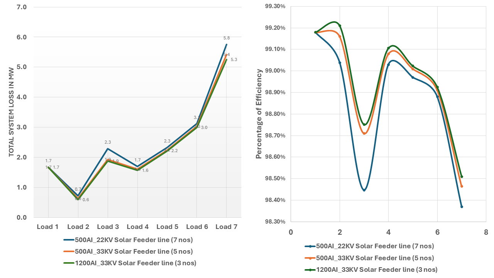
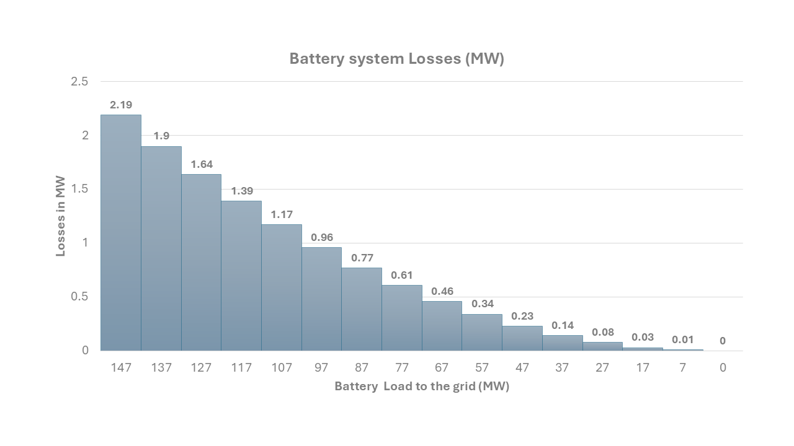
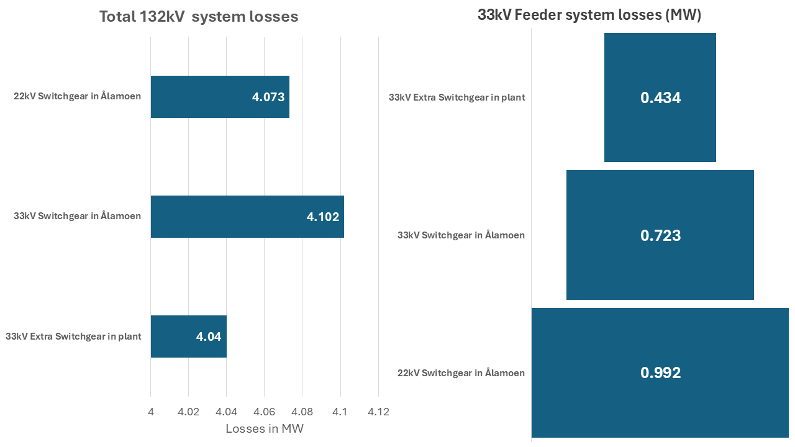
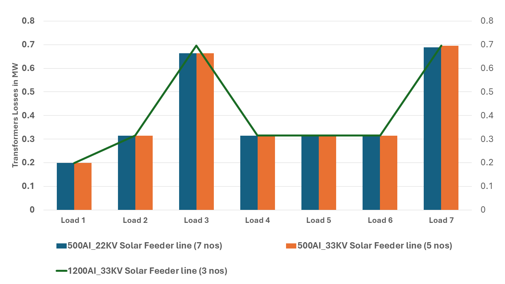
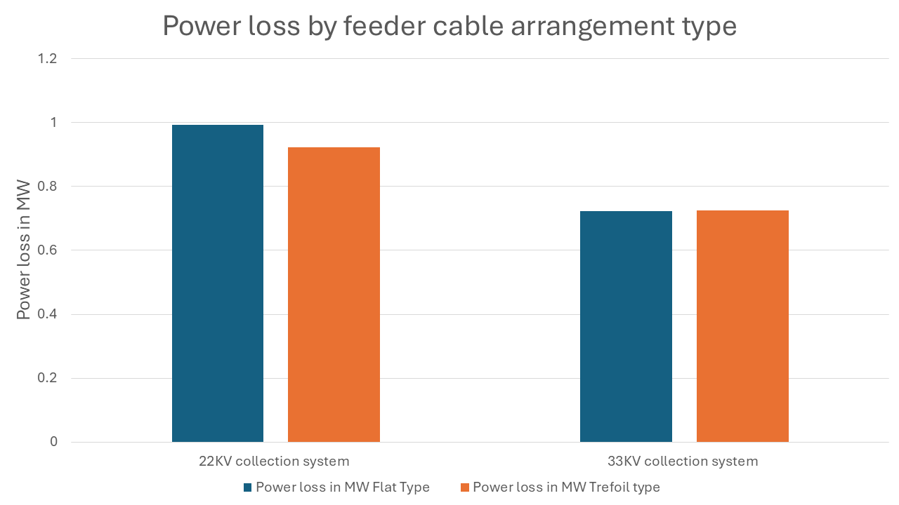

# Project Title

Feasibility Study on Connecting a 150 MW Solar Park to a Radial Power Network in Hjartdal Municipality

# Project Description

Considering both technical and economic aspects, this study provides a comprehensive steady-state feasibility analysis for integrating a solar photovoltaic (PV) park into a hydro-assisted multi-voltage level transmission network.

# Power System Analysis Tool

This tool allows you to run different power flow analyses and generate Single Line Diagrams (SLDs) for various electrical power system configurations.

## Project Structure

```
├── main.py                 # Main script for running analyses
├── Run.ipynb               # Jupyter notebook interface for running main.py
├── CSS/                    # Folder containing analysis configuration notebooks
│   ├── SLD_Transformer_Station_Near_Aalamoen_22KV.ipynb
│   ├── SLD_Transformer_Station_Near_Aalamoen_33KV.ipynb
│   ├── SLD_Transformer_Station_Near_Aalamoen_33KV_with_BESS_extra_bus_in_solar_plant.ipynb
│   ├── SLD_Transformer_Station_Near_the_Solar_Plant_22KV.ipynb
│   └── SLD_Transformer_Station_Near_the_Solar_Plant_33KV.ipynb
├── SLD diagram/            # Output folder for generated SVG diagrams
└── analysis/               # Folder containing analysis result charts
```

## Running the Tool

### Option 1: Using the Python Script

You can run the tool directly using Python:

```
python main.py
```

This will launch a command-line interface where you can:
- List available analysis configurations
- Run a specific analysis
- List generated SVG diagrams

### Option 2: Using Jupyter Notebook (Recommended)

If you prefer using Jupyter Notebook, use the provided `Run.ipynb` file:

1. Launch Jupyter Notebook:
   ```
   jupyter notebook
   ```

2. Open `Run.ipynb` from the file browser

This will execute the main.py script within the Jupyter environment.

## Using the Tool

1. When you run the tool, you'll see a list of available analysis configurations
2. Select an analysis to run by entering its number
3. The tool will execute the selected analysis and display the power flow results
4. SVG diagrams will be generated in the "SLD diagram" folder

## Available Analyses

The tool includes several power system analysis configurations:

- Transformer Station Near Aalamoen (22KV)
- Transformer Station Near Aalamoen (33KV)
- Transformer Station Near Aalamoen with BESS (33KV)
- Transformer Station Near the Solar Plant (22KV)
- Transformer Station Near the Solar Plant (33KV)

Each analysis provides power flow results, voltage profiles, and generates single-line diagrams.

## Power Flow Analysis Results

The following graphs show the comparative analysis results for the different power system configurations:

### System Losses and Efficiency Comparison



This graph compares the total system losses (in MW) and efficiency (in %) for different feeder configurations:
- 500Al_22KV Solar Feeder line (7 nos)
- 500Al_33KV Solar Feeder line (5 nos)
- 1200Al_33KV Solar Feeder line (3 nos)

### Battery System Losses



This chart shows the battery system losses (in MW) under different load conditions (from 0 to 147 MW).

### System Losses by Voltage Level



Comparison of total 132kV system losses and feeder system losses for different configurations:
- 22kV Switchgear in Alamoen
- 33kV Switchgear in Alamoen
- 33kV Extra Switchgear in plant

### Transformer Losses Comparison



This graph compares transformer losses (in MW) across different load conditions for the three configurations.

### Power Loss by Feeder Cable Arrangement



Comparison of power losses between flat type and trefoil type cable arrangements for 22kV and 33kV collection systems.
